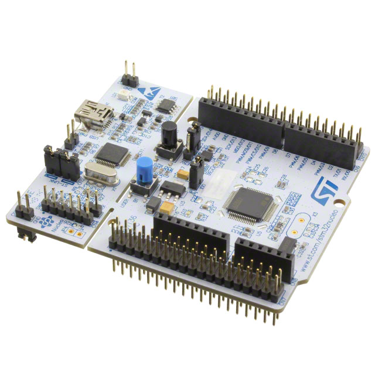

# devbit-microcontrollers-lab

> Lab exercises for the [devbit microcontrollers](https://microcontrollers.netlify.com) course

## Lab approach

1. Build embedded applications using the Nucleo L476RG prototyping board and mbed libraries.
1. Learn the internals of the STM32L476RGT6 microcontroller and program it on the register level.

Figure 1: The Nucleo L476RG prototyping board