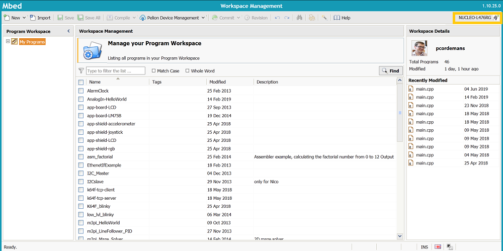
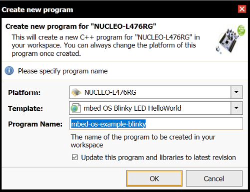
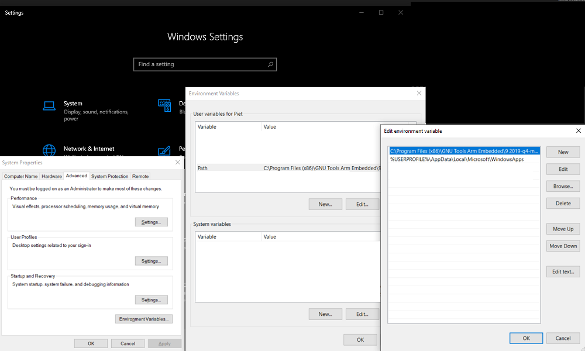
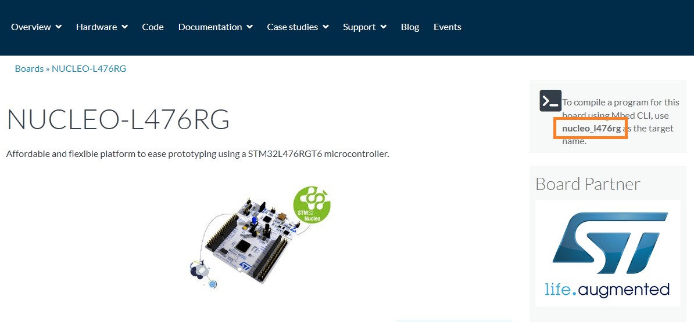
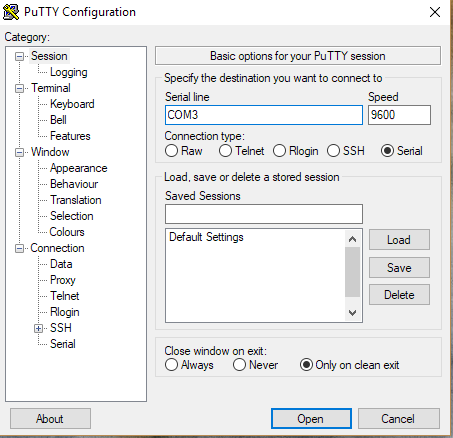
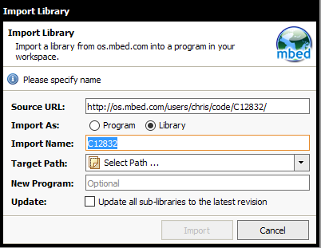

# Lab 1: The Mbed Menace

## Goal

1. Run the mbed blinky example
1. Install the mbed-cli
1. Set up serial communication with the computer
1. Explore several peripherals 

## Mbed blinky

These steps will guide you to build and run a first mbed program from the browser.

1. Register your account on [os.mbed.com](https://os.mbed.com/).
1. Log in and click on compiler in the upper right corner.
1. Select the Nucleo-L476RG as your platform, by clicking the select platorm button in the upper right corner. 
    
    

    Figure 1: Overview of the mbed compiler. Select the Nucleo-L476RG platform.

1. Create a new program. Select the *mbed OS Blinky LED HelloWorld* template.

    

    Figure 2: Select a template and give the new program a name.

1. Connect the USB connector of the Nucleo board to the pc. The board will appear as the NODE_L476RG flash drive.
1. Open *main.cpp*. Click compile. Download the *.bin* file on the NODE_L476RG flash drive. The serial communication led will flash red/yellow when the program is loaded.
1. The file *main.cpp* contains C++ code. Syntax and programming concepts are similar to C#. For example:

    ```cpp
    #include "mbed.h"
    #include "platform/mbed_thread.h"


    // Blinking rate in milliseconds
    #define BLINKING_RATE_MS 500


    int main()
    {
        // Initialize the digital pin LED1 as an output
        DigitalOut led(LED1);

        while (true) 
        {
            led = !led;
            thread_sleep_for(BLINKING_RATE_MS);
        }
    }
    ```
::: tip
Mbed provides an extensive library of classes with example code. One of these classes is the DigitalOut class to drive an output pin. Check out the documentation of the [DigitalOut class](https://os.mbed.com/docs/mbed-os/v5.15/apis/digitalout.html).
:::

::: warning Assignment
Write a program, which turns on the led for 3 seconds and turns it off for 1 second. Repeat this behavior 5 times.
::: 

## Mbed CLI

Following these instructions, you will install the mbed-cli toolchain and build a first program with it, to test your installation.

1. [Download](https://os.mbed.com/docs/mbed-os/v5.15/quick-start/offline-with-mbed-cli.html) and install the Mbed CLI. This is a command line tool, which allows to develop for mbed on your own machine. 

    ::: tip Pro Tip
    Do not install the mbed cli in a path with spaces or characters other than alphanumeric, dash or underscore.
    :::

    ::: tip For experts
    The mbed installer still installs Python 2.7. Support for Python 2.7 has ended as of 01/01/2020.

    You can install the mbed cli toolchain with a newer version of Python yourself with these [manual installation instructions.](https://os.mbed.com/docs/mbed-os/v6.7/build-tools/install-and-set-up.html). It is important to install Python version **3.7.x**. It is recommended to use a virtual environment such as [conda](https://docs.conda.io/en/latest/miniconda.html) to create a specific virtual environment for mbed.

    There is a new version of [mbed cli](https://os.mbed.com/docs/mbed-os/v6.7/build-tools/mbed-cli-2.html), which is still under development and has only official support for a limited set of boards and Mbed OS 6. If you want to use mbed cli version 2: here be dragons. 
    :::
1. Open a command line shell, e.g. Powershell and execute: 

    ```bash
    mbed import https://github.com/ARMmbed/mbed-os-example-blinky
    cd mbed-os-example-blinky
    ```

    ::: tip Possible Fix
    If the shell was open during the installer, it will not recognize the mbed command. Close the shell and reopen it, to fix this problem.
    :::
1. Download and install the latest [GNU Arm Embedded Toolchain](https://developer.arm.com/tools-and-software/open-source-software/developer-tools/gnu-toolchain/gnu-rm/downloads). This contains the GCC for ARM Embedded compiler. 

    ::: tip Don't forget
    The tools have to be added to the PATH environment variable. At the end of the installer you can select to **Add path to environment variable.**

    The mbed-cli installer contains an older version of the toolchain. Remove it from your Path Environment Variable: search in Windows settings for environment, 
    
    
    Figure 3: Change the PATH environment variable. 
    :::

1. Go to the [Nucleo-L476RG mbed website](https://os.mbed.com/platforms/ST-Nucleo-L476RG/) to discover the target name.
    
    
    
    Figure 4: Find the target name on the platform website.
1. Execute the compilation command:
    ```bash
        mbed compile --target NUCLEO_L476RG --toolchain GCC_ARM --flash
    ```

    ::: tip
    If your board is plugged in the **--flash** flag will automagically copy the *.bin* file to the board. If you did not include this flag, you will have to manually copy the *.bin* file from the **./BUILD/NUCLEO_L476RG/GCC_ARM** folder.
    :::
1. Check if the blinky led program is correctly loaded on your board.

::: tip
Compiling with a **mbed compile** command which has to include the target and toolchain every time is not user friendly. Use the **mbed config** command to set a default. For example:
```bash
mbed config target NUCLEO_L476RG
mbed config --global toolchain GCC_ARM 
```
These commands set a project local default target and a global default toolchain.

Then you can just compile with:

```bash
mbed compile --flash
```
:::

## Serial communication

Next, set up serial communication between your PC and the Nucleo board.


1. Add a *Serial* object on the **USBRX** and **USBTX** pins in **main.cpp**.
1. Use the *Serial* object to send a string with *printf*.
1. Your **main.cpp** will look like this:
    
    ```cpp
    #include "mbed.h"
    #include "platform/mbed_thread.h"


    // Blinking rate in milliseconds
    #define BLINKING_RATE_MS 500


    int main()
    {
        // Initialize the digital pin LED1 as an output
        DigitalOut led(LED1);
        // Initialize the serial UART on the USB Transmit and Receive pins
        Serial pc(USBTX, USBRX);
        // Print a string on the serial port
        pc.printf("Hello World!\n");
        while (true) 
        {
            led = !led;
            thread_sleep_for(BLINKING_RATE_MS);
        }
    }
    ```
    ::: tip Mbed OS6
    Mbed OS6 does not have a Serial class. As an alternative you can use the [BufferedSerial](https://os.mbed.com/docs/mbed-os/v6.7/apis/serial-uart-apis.html) class. The BufferedSerial class does not offer a formatted print (printf), rather you can use the write method. The write method requires two parameters, a char array and the number of characters to be sent. An example:

    ```cpp
    BufferedSerial pc(USBTX, USBRX);
    pc.write("Hello World!\n", 13);
    ```
    :::

1. Compile and flash your program to the board.
1. Download the [Putty](https://putty.org/) terminal application and run it.
1. Check on which COM port the mbed is registered:
    ```bash
        mbed detect
    ```
    
    ::: tip Output
    [mbed] Working path "C:\code\mbed\mbed-os-example-blinky" (program)

    [mbed] Detected NUCLEO_L476RG, **port COM3**, mounted D:, interface version 0221:
    [mbed] Supported toolchains for NUCLEO_L476RG
    | Target        | mbed OS 2 | mbed OS 5 |    uARM   |    IAR    |    ARM    |  GCC_ARM  | ARMC5 |
    |---------------|-----------|-----------|-----------|-----------|-----------|-----------|-------|
    | NUCLEO_L476RG | Supported | Supported | Supported | Supported | Supported | Supported |   -   |
    Supported targets: 1
    Supported toolchains: 4
    :::
1. In Putty: set up serial communication with Baudrate 9600 and the corresponding COM port.
    

    Figure 5: Putty serial configuration, Baudrate 9600 and COM3 port selected.

1. Open the connection.

    ::: warning Assignment
    Show Hello World! in Putty.
    :::

## Explore peripherals

Add some peripherals with the [mbed Application Shield](https://os.mbed.com/components/mbed-Application-Shield/), import the example programs and finally combine these peripherals in a single program.

1. Libraries exist for all components on the mbed Application Shield. These classes are not included in the standard *mbed* library. Use the online compiler to import the RGB LED, LM75B Temperature sensor and the Joystick example programs. 
1. The libraries can also be imported with the *import library* into an existing program. This copies the necessary library files into the project directory. 
    
1. Libraries are included in code with an **#include** directive. For example to include the C12832 LCD display:
    ```cpp
    #include "C12832.h"
    ```
::: warning Assignment
Make a new program which allows the potentiometers to control the color of the RGB LED. Also, show the values of the potentiometers on the LCD display or in Putty.
:::

1. Programs can also be imported using the mbed cli. To import a specific version append with the version number:
    ```bash
    mbed import https://github.com/ARMmbed/mbed-os-example-blinky#mbed-os-5.11.0
    ```
1. Using the mbed cli, it is also possible to add libraries. For example:
    ```bash
    mbed add http://os.mbed.com/users/chris/code/C12832/
    ```

::: warning Assignment
Import your program from the mbed online compiler to your local machine using the mbed cli.
:::

:::tip
In order to import the program to the mbed cli you need to publish your project in the mbed repository. 

1. Commit the code, using the commit button in the online IDE.
1. Publish the project, using the down arrow next to the commit button. 
1. Go to the webpage of your published project, and click import with Mbed cli. Use the suggested command.
:::

## More information

1. [An introduction to Arm Mbed OS 5](https://os.mbed.com/docs/mbed-os/v5.15/introduction/index.html)
1. [Mbed Full API list](https://os.mbed.com/docs/mbed-os/v5.15/apis/index.html)
1. [Working with Mbed CLI](https://os.mbed.com/docs/mbed-os/v5.15/tools/working-with-mbed-cli.html)

## Extra

1. Use the x,y,z acceleration values of the accelerometer to control the color of the RGB LED.
1. Go to the lecturer and ask for the K64F board. Try to run your programs on the K64F board.